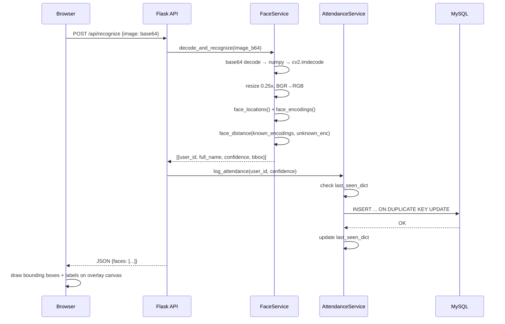
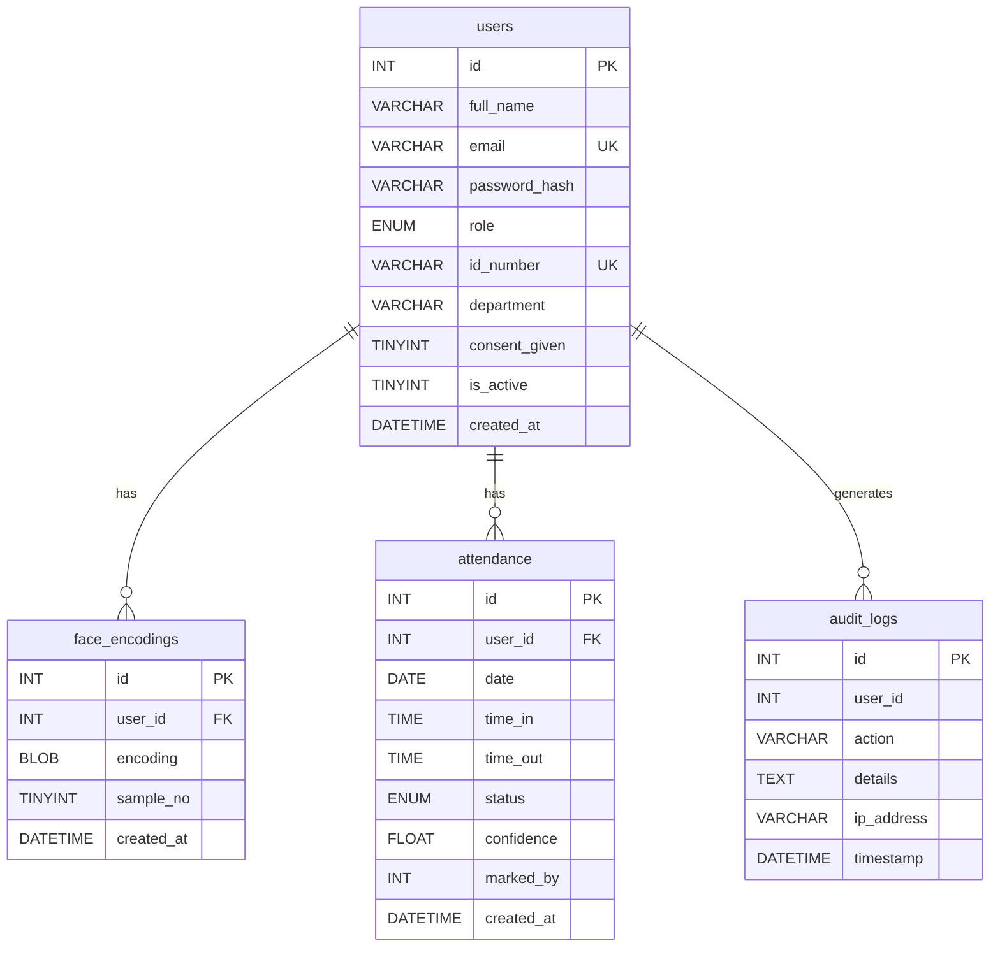

# Design Document — SmartFace Attendance System

## Overview

SmartFace is a real-time face recognition attendance monitoring system built for St. Anne College Lucena, Inc. (SACLI). It replaces manual roll-call by letting Faculty/Staff operate a browser-based kiosk that identifies registered users through a webcam feed, automatically records `time_in` and `time_out`, and surfaces attendance data to Administrators through a dashboard and report exports.

The system is a Flask web application deployed on `localhost` for capstone demonstration and LAN for institutional use. The entire recognition pipeline runs server-side: the browser captures frames via `getUserMedia`, encodes them as base64 JPEG, and POSTs them to the server — there is no direct server-side camera access. Template rendering uses Jinja2. There is no JavaScript framework, no Docker, no Redis, no WebSocket connections, and no external job queues.

**Actors:**
- **Administrator** — full access: enrollment, user management, reports, manual overrides, audit logs.
- **Faculty/Staff** — operational access: kiosk, dashboard, reports.
- **Student** — self-service only: view own attendance records.

**Quality targets (ISO/IEC 25010):**
- Page load < 3 seconds
- Recognition response < 2 seconds per frame
- Compatible with latest Chrome, Edge, Firefox on Windows 10+

---

## Architecture

### System Architecture Diagram

```mermaid
graph TD
    subgraph Browser["Browser (Client)"]
        A[Video Element<br/>getUserMedia] --> B[Canvas Frame Capture<br/>every 1000ms]
        B --> C[POST base64 JPEG<br/>/api/recognize]
        D[Overlay Canvas] --> E[Draw bounding box + label]
    end

    subgraph Flask["Flask Application Server"]
        F[Routes Layer<br/>auth · admin · attendance · api]
        G[Services Layer<br/>face_service · attendance_service]
        H[Models Layer<br/>db · user · attendance · audit]
        F --> G --> H
    end

    subgraph InMemory["In-Memory State"]
        I[known_encodings: list[ndarray]]
        J[known_user_ids: list[int]]
        K[last_seen_dict: dict[int, datetime]]
    end

    subgraph Database["MySQL — smartface_db"]
        L[(users)]
        M[(face_encodings)]
        N[(attendance)]
        O[(audit_logs)]
    end

    C --> F
    F --> InMemory
    H --> Database
    InMemory -.loaded at startup.-> H
```

### Request Lifecycle — Recognition



### dlib / face_recognition Installation Strategy

Dependency installation must be verified before any application code is written (Day 1, Step 1).

| Priority | Method | Command |
|---|---|---|
| 1 (primary) | Build from source | `pip install cmake` then `pip install dlib` |
| 2 (fallback) | Pre-compiled wheel | Download `dlib-19.24.x-cp311-win_amd64.whl` from Gohlke wheels repo, then `pip install dlib-*.whl` |
| 3 (fallback) | Conda | `conda install -c conda-forge dlib` |
| 4 (contingency) | Swap engine | Replace `face_recognition` with `deepface` using `DeepFace.represent()` + cosine similarity; adjust TOLERANCE from Euclidean (0.45) to cosine (0.40); all other pipeline steps remain identical |

If `pip install dlib` does not complete within 15 minutes, **stop and escalate** — do not debug build toolchain. The contingency swap (`deepface`) is a drop-in at the `face_service.py` level only; no route or model changes are needed.

---

## Components and Interfaces

### Flask Application Entry Point (`app.py`)

Responsibilities:
- Create and configure the Flask app instance
- Load environment variables via `python-dotenv`
- Register all blueprints
- Call `face_service.load_known_faces()` at startup
- Configure session lifetime (30-minute inactivity)
- Register error handlers (404, 403, 500)

```python
# Snippet — startup hook
with app.app_context():
    face_service.load_known_faces()

# Commented-out LAN HTTPS line (required by spec)
# app.run(host='0.0.0.0', port=5000, ssl_context='adhoc')
app.run(host='0.0.0.0', port=5000, debug=False)
```

### Configuration (`config.py`)

All tuneable constants live here. Values are loaded from `.env` via `os.getenv` with documented defaults.

```python
TOLERANCE   = float(os.getenv('TOLERANCE', 0.45))    # face distance threshold
LATE_TIME   = os.getenv('LATE_TIME', '08:00:00')      # HH:MM:SS
SECRET_KEY  = os.getenv('SECRET_KEY', 'change-me')
DB_HOST     = os.getenv('DB_HOST', 'localhost')
DB_PORT     = int(os.getenv('DB_PORT', 3306))
DB_USER     = os.getenv('DB_USER', 'root')
DB_PASS     = os.getenv('DB_PASS', '')
DB_NAME     = os.getenv('DB_NAME', 'smartface_db')
UPLOAD_DIR  = os.getenv('UPLOAD_DIR', 'uploads/face_samples')
BRIGHTNESS_THRESHOLD = int(os.getenv('BRIGHTNESS_THRESHOLD', 50))
```

### Routes Layer

**`routes/auth.py`** — Login, logout, `@role_required` decorator

The `@role_required` decorator is the system's RBAC enforcement point. It:
1. Checks that a valid Flask session exists; returns 401 if not.
2. Checks that the session user's role is in the allowed roles list; returns 403 if not.
3. On 5 consecutive failures within 15 minutes, sets a lockout timestamp in session and rejects further attempts.

```python
def role_required(*roles):
    def decorator(f):
        @wraps(f)
        def decorated(*args, **kwargs):
            if 'user_id' not in session:
                return redirect(url_for('auth.login')), 401
            if session.get('role') not in roles:
                abort(403)
            return f(*args, **kwargs)
        return decorated
    return decorator
```

**`routes/api.py`** — JSON endpoints

| Endpoint | Method | Handler | Roles |
|---|---|---|---|
| `/api/recognize` | POST | `recognize()` | admin, faculty |
| `/api/enroll` | POST | `enroll()` | admin |
| `/api/live-feed` | GET | `live_feed()` | admin, faculty |

**`routes/admin.py`** — Enrollment page, user management, audit log viewer, manual override

**`routes/attendance.py`** — Kiosk page, dashboard, reports, CSV export, student self-service

### Services Layer

**`services/face_service.py`**

Module-level state (never reassigned mid-request; only replaced atomically by `reload_known_faces()`):

```python
known_encodings: list[np.ndarray] = []   # 128-dim float64 each
known_user_ids:  list[int]        = []   # parallel index
_cache_lock = threading.Lock()           # guards atomic replacement
```

Key functions:

| Function | Signature | Description |
|---|---|---|
| `load_known_faces()` | `() -> None` | Called at app startup; populates module-level lists from DB |
| `reload_known_faces()` | `() -> None` | Atomically replaces both lists; called after enrollment |
| `recognize_frame(image_b64)` | `(str) -> list[dict]` | Full pipeline: decode → resize → detect → encode → match |
| `encode_samples(image_list)` | `(list[bytes]) -> list[np.ndarray]` | Returns one encoding per image |
| `serialize_encoding(enc)` | `(np.ndarray) -> bytes` | `enc.tobytes()` |
| `deserialize_encoding(blob)` | `(bytes) -> np.ndarray` | `np.frombuffer(blob, dtype=np.float64)` |

The recognition inner loop (heavily commented per spec requirement):

```python
# Step 1: Decode base64 JPEG to numpy array
img_data = base64.b64decode(image_b64)
np_arr   = np.frombuffer(img_data, np.uint8)
frame    = cv2.imdecode(np_arr, cv2.IMREAD_COLOR)

# Step 2: Downscale 0.25x — ~4x speedup, non-negotiable for usable framerate
small   = cv2.resize(frame, (0, 0), fx=0.25, fy=0.25)

# Step 3: BGR (OpenCV default) → RGB (face_recognition expects RGB)
rgb     = cv2.cvtColor(small, cv2.COLOR_BGR2RGB)

# Step 4: Detect face bounding boxes in the downscaled frame
locs    = face_recognition.face_locations(rgb)

# Step 5: Compute 128-dim facial encodings for each detected face
encs    = face_recognition.face_encodings(rgb, locs)

results = []
for enc, loc in zip(encs, locs):
    # Step 6: Euclidean distances against every known encoding in cache
    distances  = face_recognition.face_distance(known_encodings, enc)
    best_index = int(np.argmin(distances))
    best_dist  = float(distances[best_index])

    # Step 7: Match if within TOLERANCE (0.45 is stricter than the 0.6 default)
    # LIVENESS HOOK: a liveness check (blink / head-movement) would be inserted here
    #   before accepting the match — currently deferred as a future enhancement.
    if known_encodings and best_dist <= config.TOLERANCE:
        uid        = known_user_ids[best_index]
        name       = get_user_name(uid)
        confidence = round((1 - best_dist) * 100, 2)
    else:
        uid, name, confidence = None, "Unknown", None

    # Step 8: Scale bounding box back to original frame dimensions (factor of 4)
    top, right, bottom, left = [v * 4 for v in loc]
    results.append({
        "user_id": uid, "full_name": name,
        "confidence": confidence,
        "bounding_box": {"top": top, "right": right, "bottom": bottom, "left": left}
    })

return results
```

**`services/attendance_service.py`**

Module-level debounce state:

```python
last_seen_dict: dict[int, datetime] = {}   # user_id → last logged timestamp
```

Key functions:

| Function | Signature | Description |
|---|---|---|
| `log_attendance(user_id, confidence)` | `(int, float) -> dict` | Applies debounce rules; issues INSERT or UPDATE |
| `_is_debounce_elapsed(user_id)` | `(int) -> bool` | Returns True if no entry or elapsed >= 60s |
| `_determine_status(time_in)` | `(time) -> str` | `'present'` or `'late'` based on LATE_TIME |

Debounce logic:

```python
def log_attendance(user_id: int, confidence: float) -> dict:
    now  = datetime.now()
    date = now.date()

    # Guard 1: in-memory check (no DB hit if debounce not elapsed)
    if not _is_debounce_elapsed(user_id):
        return {"logged": False, "reason": "debounce"}

    time_in_val = now.time()
    status      = _determine_status(time_in_val)

    # Guard 2: database-level uniqueness via ON DUPLICATE KEY UPDATE
    sql = """
        INSERT INTO attendance (user_id, date, time_in, status, confidence)
        VALUES (%s, %s, %s, %s, %s)
        ON DUPLICATE KEY UPDATE time_out = VALUES(time_in), confidence = VALUES(confidence)
    """
    # Execute and update last_seen_dict only on success
    ...
```

### Models Layer

**`models/db.py`** — Connection pool and query helpers

Uses `mysql-connector-python` pooling. Provides `get_connection()`, `execute_query()`, and `execute_many()`. All queries use parameterized placeholders to prevent SQL injection.

**`models/user.py`**, **`models/attendance.py`**, **`models/audit.py`** — Thin data-access wrappers returning plain Python dicts. No ORM.

### Static JavaScript

**`static/js/camera.js`** — Kiosk frame capture loop

```javascript
// Capture loop: every 1000ms, skip if prior request still pending
let pending = false;
setInterval(() => {
    if (pending) return;           // skip this tick if previous POST not done
    pending = true;
    const canvas  = document.createElement('canvas');
    canvas.width  = video.videoWidth;
    canvas.height = video.videoHeight;
    canvas.getContext('2d').drawImage(video, 0, 0);

    // Client-side brightness check (mean pixel value on 0-255 scale)
    const pixels = canvas.getContext('2d').getImageData(0, 0, canvas.width, canvas.height).data;
    const mean   = pixels.reduce((s, v, i) => i % 4 === 3 ? s : s + v, 0) / (pixels.length * 0.75);
    brightnessWarning.style.display = mean < BRIGHTNESS_THRESHOLD ? 'block' : 'none';

    const b64 = canvas.toDataURL('image/jpeg', 0.7).split(',')[1];
    fetch('/api/recognize', { method: 'POST', body: JSON.stringify({image: b64}), headers: {'Content-Type': 'application/json'} })
        .then(r => r.json())
        .then(data => { drawOverlay(data.faces); pending = false; })
        .catch(() => { pending = false; });
}, 1000);
```

**`static/js/enroll.js`** — Enrollment webcam capture (3–5 shots with thumbnail preview)

**`static/js/dashboard.js`** — Live feed polling every 3 seconds, in-place table update

### Templates

All templates extend `base.html` which provides:
- SACLI color scheme (light green `#4CAF82`, white `#FFFFFF`, gold `#D4AF37`, near-black `#1A1A1A`)
- Role-aware navigation (nav links rendered conditionally via `{{ session.role }}`)
- Toast notification container (used for recognition feedback)
- Audio elements for success/failure cues (triggered via JS after recognition response)

`kiosk.html` uses large font sizes (≥ 1.5rem body, ≥ 2rem name label) for projector visibility.

---

## Data Models

### Entity Relationship Diagram



### Table Notes

**`users`**
- `role`: `ENUM('admin','faculty','student')` — controls all RBAC decisions.
- `consent_given`: must be `1` before any `face_encodings` row is created (RA 10173).
- `is_active = 0` prevents login; Admin cannot deactivate own account.

**`face_encodings`**
- `encoding` stored as `BLOB` using `encoding_array.tobytes()`.
- Deserialized via `np.frombuffer(blob, dtype=np.float64)` — produces shape `(128,)`.
- 3–5 rows per user; all loaded flat into `known_encodings` for multi-sample matching accuracy.

**`attendance`**
- `UNIQUE KEY uniq_user_day (user_id, date)` — database-level guarantee of at most one row per user per day.
- `status`: `'present'` if `time_in <= LATE_TIME`, `'late'` if after, `'absent'` for unfilled days, `'manual'` for Admin overrides.
- `marked_by`: NULL for automatic records; Admin `user_id` for manual overrides.
- Application always uses `INSERT ... ON DUPLICATE KEY UPDATE` — never raw `INSERT` alone.

**`audit_logs`**
- Written for: login, logout, enrollment, manual override, user deactivation, biometric deletion.
- `user_id` is nullable (covers failed login attempts where no user ID is known).
- Write failures must be logged to the application error log; they must not surface as unhandled exceptions.

### Encoding Serialization Round-Trip

```python
# Serialize (store to DB)
blob = encoding.tobytes()                          # bytes object, len = 128 * 8 = 1024

# Deserialize (load from DB)
encoding = np.frombuffer(blob, dtype=np.float64)   # shape (128,), dtype float64
```

This round-trip must be lossless — the deserialized array must be element-wise equal to the original. This is a core correctness invariant (see Property 1).

---

## Correctness Properties

*A property is a characteristic or behavior that should hold true across all valid executions of a system — essentially, a formal statement about what the system should do. Properties serve as the bridge between human-readable specifications and machine-verifiable correctness guarantees.*

### Property 1: Facial Encoding Serialization Round-Trip

*For any* 128-dimensional `float64` numpy array representing a facial encoding, serializing it with `.tobytes()` and deserializing with `np.frombuffer(blob, dtype=np.float64)` must produce an array that is element-wise equal to the original.

**Validates: Requirements 3.7, 4.2**

---

### Property 2: Cache–Database Alignment After Reload

*For any* state of the `face_encodings` table, after `reload_known_faces()` completes, the lengths of `known_encodings` and `known_user_ids` must be equal to each other and equal to the count of non-null, deserializable encoding rows in the database; and every `user_id` in `known_user_ids` at index `i` must correspond to the user whose encoding is at `known_encodings[i]`.

**Validates: Requirements 4.2, 4.4**

---

### Property 3: RBAC — Student Role Blocked from Non-Student Routes

*For any* HTTP request made with a valid authenticated session bearing the `student` role to any route other than `/my-attendance` and `/logout`, the response status code must be 403.

**Validates: Requirements 2.2, 2.6**

---

### Property 4: RBAC — Faculty Role Blocked from Admin-Only Routes

*For any* HTTP request made with a valid authenticated session bearing the `faculty` role to any Administrator-only route (`/users`, `/enroll`, `/audit`, `/attendance/manual`, `/api/enroll`), the response status code must be 403.

**Validates: Requirements 2.3, 2.5**

---

### Property 5: Password Storage — No Plaintext Persisted

*For any* non-empty password string, the value stored in the `users.password_hash` column after a registration or password update operation must not equal the original plaintext string, and `werkzeug.security.check_password_hash(stored_hash, original_password)` must return `True`.

**Validates: Requirements 1.6**

---

### Property 6: Confidence Formula Correctness

*For any* face distance value `d` in the closed interval `[0.0, 0.45]`, the computed confidence must equal `round((1 - d) * 100, 2)`, and the resulting value must lie within `[55.0, 100.0]`.

**Validates: Requirements 5.6**

---

### Property 7: Unknown Face Classification

*For any* face whose best Euclidean distance against the known encodings cache exceeds `0.45`, the recognition result for that face must have `user_id` set to `null`, `full_name` set to `"Unknown"`, and must not trigger any attendance logging operation.

**Validates: Requirements 5.7, 6.1**

---

### Property 8: Attendance Status Assignment

*For any* recognized user on any given date, if `time_in` is at or before `LATE_TIME`, the attendance record's `status` must be `'present'`; if `time_in` is strictly after `LATE_TIME`, the `status` must be `'late'`.

**Validates: Requirements 6.1**

---

### Property 9: Debounce Uniqueness Invariant

*For any* sequence of recognition events for the same `user_id` on the same calendar date, regardless of how many recognitions occur, the count of rows in the `attendance` table for `(user_id, date)` must always be exactly 1.

**Validates: Requirements 6.2, 6.3, 6.4**

---

### Property 10: Debounce Skip When Elapsed < 60 Seconds

*For any* recognized `user_id` where the elapsed time since the value in `last_seen_dict[user_id]` is strictly less than 60 seconds, the `attendance` table must remain unchanged and `last_seen_dict` must remain unchanged.

**Validates: Requirements 6.3**

---

### Property 11: Multi-Face Frame Response Completeness

*For any* submitted frame containing `N` detectable faces, the `faces` array in the JSON response must contain exactly `N` entries, with each entry containing a `bounding_box`, a `full_name`, and a `user_id` (which may be `null`).

**Validates: Requirements 5.10**

---

### Property 12: Student Data Isolation

*For any* authenticated session bearing the `student` role, every attendance record returned by `/my-attendance` must have a `user_id` equal to the session's authenticated user's `id`; no record belonging to a different user may be included in the response.

**Validates: Requirements 12.1, 12.3**

---

## Error Handling

### Recognition Pipeline Errors

| Condition | Behavior |
|---|---|
| Invalid base64 payload | Return HTTP 400 `{"error": "Invalid image payload"}` |
| Decoding produces `None` frame | Return HTTP 400 `{"error": "Could not decode image"}` |
| No face detected in frame | Return HTTP 200 `{"faces": []}` — never a 500 |
| Multiple faces in frame | Process all faces; log attendance for each matched face independently |
| `known_encodings` list is empty | Return all faces as Unknown — no exception raised |
| Recognition takes > 2 seconds | Response still returns; no timeout kill (log a warning) |

### Enrollment Pipeline Errors

| Condition | Behavior |
|---|---|
| No face detected in one sample | Return JSON error identifying the sample index (1–5); no DB writes |
| Duplicate email or ID number | Return JSON error naming the conflicting field; no DB writes |
| Consent checkbox unchecked | Front-end blocks submission; server also rejects with 400 |
| Partial failure after user row created | Roll back entire transaction; return error identifying the failed step |
| Camera unavailable on enrollment page | Display error panel; disable capture controls |

### Authentication and Session Errors

| Condition | Behavior |
|---|---|
| Invalid credentials | Generic message — do not identify which field failed |
| 5 failed attempts in 15 min | Lock account for 15 minutes; display lockout message |
| Session inactive > 30 min | Invalidate on next request; redirect to login with expiry message |
| Unauthenticated request to protected route | Redirect to `/login` (HTTP 302) |
| Unrecognized role in `@role_required` | Deny with 403; write error to application log |

### Database Errors

| Condition | Behavior |
|---|---|
| DB unreachable at startup (encoding load) | Start with empty cache; log error; remain operational |
| DB unreachable during recognition | Return HTTP 503 `{"error": "Database unavailable"}` |
| Attendance INSERT/UPDATE fails | Leave `last_seen_dict` unchanged; return error response |
| Audit log write fails | Log to application error log; do not raise unhandled exception to user; roll back parent transaction if inside one |
| Manual override audit write fails | Roll back attendance change; return error |

### Client-Side Errors

| Condition | Behavior |
|---|---|
| `getUserMedia` denied or unavailable | Display camera instruction panel; do not show blank screen |
| Frame brightness mean < 50/255 | Display visible warning banner; remove when brightness recovers |
| Recognition returns `{"faces": []}` | Display "No face detected" status indicator; continue capture loop |
| Unknown face in response | Display "Unknown" label and bounding box; no attendance logging |
| Live feed endpoint unresponsive (> 5s) | Retain last loaded table; show "Live feed temporarily unavailable" indicator |

---

## Testing Strategy

### Overview

SmartFace uses a dual testing approach:
- **Unit tests** for specific examples, edge cases, and error conditions.
- **Property-based tests** for universal invariants across a wide range of generated inputs.

Unit tests focus on concrete, deterministic behaviors. Property tests handle input-space coverage through randomization. Both are needed; neither replaces the other.

The property-based testing library for this project is **[Hypothesis](https://hypothesis.readthedocs.io/)** (Python). Each property test runs a minimum of 100 iterations. Tests are located in `tests/` at the project root.

### Test File Structure

```
tests/
├── test_face_service.py         # Properties 1, 2, 6, 7, 11
├── test_attendance_service.py   # Properties 8, 9, 10
├── test_auth.py                 # Properties 3, 4, 5 + example-based auth tests
├── test_student_isolation.py    # Property 12
├── test_enrollment.py           # Integration: enrollment pipeline
├── test_dashboard.py            # Integration: live feed, dashboard counts
├── test_reports.py              # Integration: CSV export, filter validation
├── test_override.py             # Integration: manual override + audit trail
└── conftest.py                  # Fixtures: test DB, test client, mock encodings
```

### Property-Based Tests (Hypothesis)

Each property test references the corresponding design property by tag comment.

**Property 1 — Facial Encoding Serialization Round-Trip**
```python
# Feature: smartface-attendance-system, Property 1: Encoding round-trip
@given(arrays(dtype=np.float64, shape=128))
def test_encoding_round_trip(enc):
    blob = enc.tobytes()
    recovered = np.frombuffer(blob, dtype=np.float64)
    assert np.array_equal(enc, recovered)
```

**Property 2 — Cache–Database Alignment**
```python
# Feature: smartface-attendance-system, Property 2: Cache-DB alignment after reload
@given(lists(arrays(dtype=np.float64, shape=128), min_size=0, max_size=50))
def test_cache_reload_alignment(encoding_list):
    # Insert encodings into test DB, call reload_known_faces(),
    # assert len(known_encodings) == len(known_user_ids) == len(encoding_list)
    ...
```

**Property 3 — Student RBAC**
```python
# Feature: smartface-attendance-system, Property 3: Student role blocked from non-student routes
@given(sampled_from(NON_STUDENT_ROUTES))
def test_student_blocked(route):
    client.set_session(role='student')
    response = client.get(route)
    assert response.status_code == 403
```

**Property 4 — Faculty RBAC**
```python
# Feature: smartface-attendance-system, Property 4: Faculty blocked from admin-only routes
@given(sampled_from(ADMIN_ONLY_ROUTES))
def test_faculty_blocked(route):
    client.set_session(role='faculty')
    response = client.get(route)
    assert response.status_code == 403
```

**Property 5 — Password Storage**
```python
# Feature: smartface-attendance-system, Property 5: No plaintext passwords stored
@given(text(min_size=8, max_size=64).filter(lambda s: s.strip()))
def test_password_not_stored_plaintext(password):
    hashed = generate_password_hash(password)
    assert hashed != password
    assert check_password_hash(hashed, password) is True
```

**Property 6 — Confidence Formula**
```python
# Feature: smartface-attendance-system, Property 6: Confidence formula correctness
@given(floats(min_value=0.0, max_value=0.45))
def test_confidence_formula(distance):
    confidence = round((1 - distance) * 100, 2)
    assert 55.0 <= confidence <= 100.0
    assert confidence == compute_confidence(distance)
```

**Property 7 — Unknown Face Classification**
```python
# Feature: smartface-attendance-system, Property 7: Unknown face above tolerance
@given(floats(min_value=0.451, max_value=2.0))
def test_unknown_face_above_tolerance(distance):
    result = classify_face_match(distance)
    assert result['user_id'] is None
    assert result['full_name'] == "Unknown"
```

**Property 8 — Attendance Status**
```python
# Feature: smartface-attendance-system, Property 8: Status assignment by time_in vs LATE_TIME
@given(times())
def test_attendance_status_assignment(time_in):
    late_threshold = datetime.strptime(config.LATE_TIME, '%H:%M:%S').time()
    status = determine_status(time_in)
    if time_in <= late_threshold:
        assert status == 'present'
    else:
        assert status == 'late'
```

**Property 9 — Debounce Uniqueness**
```python
# Feature: smartface-attendance-system, Property 9: At most one attendance row per user per day
@given(integers(min_value=1, max_value=1000), lists(integers(min_value=0, max_value=3600), min_size=1, max_size=20))
def test_debounce_uniqueness(user_id, recognition_offsets):
    # Simulate N recognitions at various second offsets, assert row count == 1
    ...
```

**Property 10 — Debounce Skip**
```python
# Feature: smartface-attendance-system, Property 10: DB unchanged when elapsed < 60s
@given(integers(min_value=0, max_value=59))
def test_debounce_skip_under_60s(elapsed_seconds):
    # Set last_seen_dict[user_id] to now - elapsed_seconds
    # Call log_attendance, assert attendance table unchanged
    ...
```

**Property 11 — Multi-Face Response Completeness**
```python
# Feature: smartface-attendance-system, Property 11: N faces in frame → N entries in response
@given(integers(min_value=0, max_value=5))
def test_multi_face_response_count(n_faces):
    # Mock face_recognition to return n_faces locations and encodings
    result = face_service.recognize_frame(mock_frame_with_n_faces(n_faces))
    assert len(result) == n_faces
```

**Property 12 — Student Data Isolation**
```python
# Feature: smartface-attendance-system, Property 12: Student only sees own records
@given(integers(min_value=1, max_value=100))
def test_student_data_isolation(student_id):
    client.set_session(role='student', user_id=student_id)
    response = client.get('/my-attendance')
    records = response.json['records']
    assert all(r['user_id'] == student_id for r in records)
```

### Unit Tests (Example-Based)

**Authentication:**
- Correct credentials → session created, redirected to role landing page.
- Wrong email → generic error message (same as wrong password).
- Wrong password → generic error message (same as wrong email).
- Session timeout after 30 minutes inactive.
- Logout clears session and writes audit log.

**Enrollment:**
- Valid submission with 3 images → user row created, 3 encoding rows, audit log written, cache reloaded.
- Submission with no consent → 400 error, no DB records.
- Submission with image containing no face → JSON error with sample index, no DB records.
- Duplicate email conflict → error names the `email` field.
- Duplicate ID number conflict → error names the `id_number` field.

**Reports / CSV:**
- Valid filter → CSV with header row and matching records.
- No matching records → CSV with header row only, no error.
- Start date > end date → error response, no CSV file returned.

**Manual Override:**
- Valid override → attendance record updated, `status = 'manual'`, `marked_by` set to admin ID.
- Non-existent `user_id` → 404 error, no DB change.
- Date > 365 days in past → error, no DB change.
- Audit write failure → attendance change rolled back.

**Edge Cases:**
- Empty `known_encodings` cache → recognition returns all Unknown, no exception.
- DB unreachable at startup → cache empty, app starts, error logged.
- Recognition returns `{"faces": []}` → kiosk UI shows "No face detected", capture loop continues.
- Frame mean brightness < 50 → warning banner visible; ≥ 50 → warning hidden.

### Integration Tests

Full end-to-end tests against a test MySQL database:
- Enrollment → recognize → attendance record verified in DB.
- Day boundary: two recognitions across midnight → two separate attendance rows.
- Concurrent enrollment and recognition: cache state consistent after `reload_known_faces()`.
- CSV export: filter produces expected rows in correct column order.
- Live feed: polling returns today's records only.

### Performance Benchmarks (manual verification)

These are not automated tests — they are verified manually during Day 5 polish:
- Page load < 3 seconds under single concurrent user.
- `POST /api/recognize` response < 2 seconds on target hardware.
- Encoding cache load < 5 seconds for 10,000 entries.

### Test Configuration

```python
# conftest.py (pytest fixture)
@pytest.fixture
def test_app():
    app.config['TESTING'] = True
    app.config['DB_NAME'] = 'smartface_test_db'
    with app.test_client() as client:
        yield client

# Run property tests with minimum 100 iterations
settings = Settings(max_examples=100, deadline=5000)
```

Run tests (single pass, no watch mode):
```
pytest tests/ --tb=short -q
```
